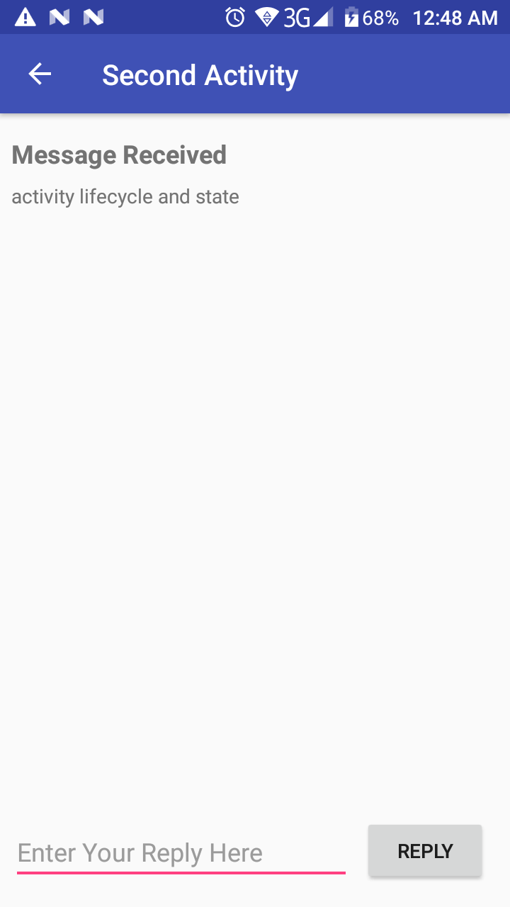

# login Activity lifecycle and state


## Screenshot


## Usage
The Activity lifecycle is a set of states an Activity migrates through, beginning when it is first created and ending when the Android system reclaims the resources for that Activity.
As the user navigates from one Activity to another, and inside and outside of your app, each Activity moves between states in the Activity lifecycle.
Each state in the Activity lifecycle has a corresponding callback method you can override in your Activity class.
The lifecycle methods are onCreate(), onStart(), onPause(), onRestart(), onResume(), onStop(), onDestroy().
Overriding a lifecycle callback method allows you to add behavior that occurs when your Activity transitions into that state.
Device configuration changes such as rotation results in the Activity being destroyed and recreated as if it were new.
A portion of the Activity state is preserved on a configuration change, including the current values of EditText elements. For all other data, you must explicitly save that data yourself.
Save Activity instance state in the onSaveInstanceState() method.
Instance state data is stored as simple key/value pairs in a Bundle. Use the Bundle methods to put data into and get data back out of the Bundle.
Restore the instance state in onCreate(), which is the preferred way, or onRestoreInstanceState().
Explicitly saving state data through lifecycle transation is cumbersome. ViewModel and Lifecycle aware components are part of the answer.
```


TwoActivitiesLifeCycle is a version of TwoActivities that prints messages
to the logs on Activity lifecycle state changes. It also implements
onSaveInstanceState() to maintain the Activity state across
configuration changes.

Pre-requisites
--------------

For this app you should be familiar with:

* The TwoActivities app.
* The Android Activity lifecycle.
* The effect of configuration changes (such as rotation) on Activity state.

Getting Started
---------------

1. Download and open this sample in Android Studio.

License
-------

Copyright 2018 Google, Inc.

Licensed to the Apache Software Foundation (ASF) under one or more contributor
license agreements.  See the NOTICE file distributed with this work for
additional information regarding copyright ownership.  The ASF licenses this
file to you under the Apache License, Version 2.0 (the "License"); you may not
use this file except in compliance with the License.  You may obtain a copy of
the License at

  http://www.apache.org/licenses/LICENSE-2.0

Unless required by applicable law or agreed to in writing, software
distributed under the License is distributed on an "AS IS" BASIS, WITHOUT
WARRANTIES OR CONDITIONS OF ANY KIND, either express or implied.  See the
License for the specific language governing permissions and limitations under
the License.
